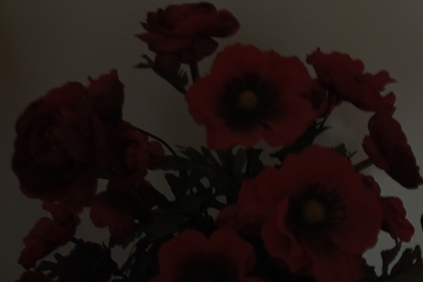
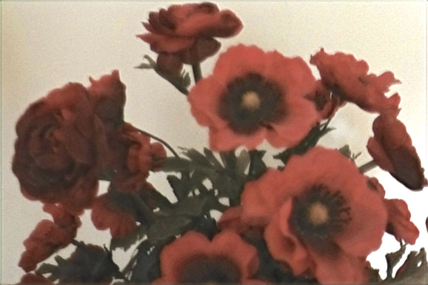
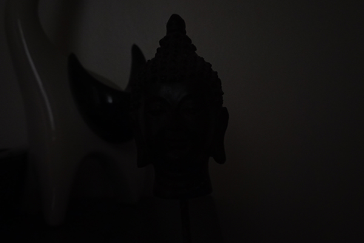
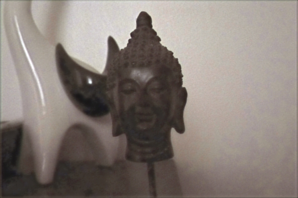

# Low light image recovery with MIRNet

### Streamlit app aimed at recovering low light photography using MIRNet

https://keras.io/examples/vision/mirnet/

<hr>

Open a command prompt and `cd` to a new directory of your choosing:

Create a virtual environment with:
```
python -m venv "venv"
venv\Scripts\activate
```

To install do:
```
git clone https://github.com/vluz/LLRMIRNet.git
cd LLRMIRNet
pip install -r requirements.txt
```

To run do:<br>
```
streamlit run recover.py
``` 

Inrterface will open in a new browser window

***Takes a long time to run the first time as*** 
<br>
***it has to download a large amount of files.***

To exit the virtual environment do:
```
venv\Scripts\deactivate
```

<hr>

Examples:
<br>



<br>




<br>
